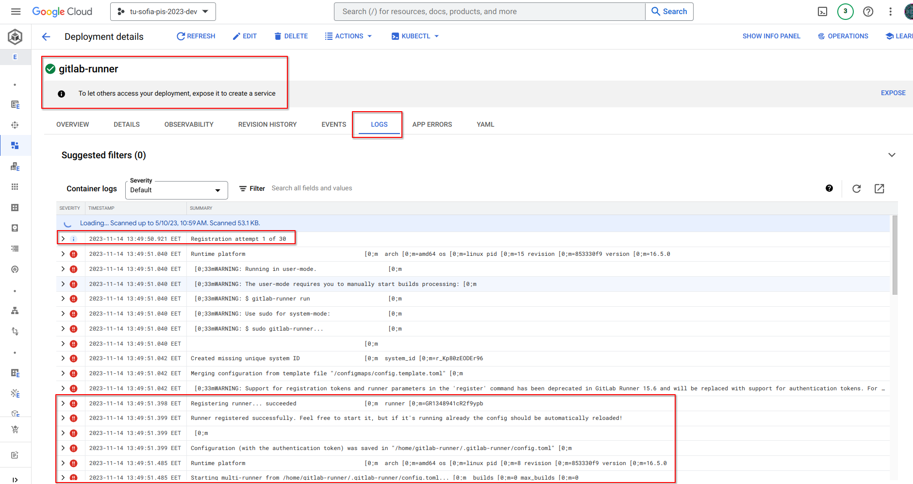

# Deploy GitLab Runner on Google Kubernetes Engine (GKE)

GitLab Runner can be installed to the GCP project GKE cluster either with BASH scripts (manually) or using 
[Helm Charts](https://helm.sh/). Installing it manually is the preferred method, as it will give you more insights
into how GitLab Runner is installed and how to configure it correctly with Kubernetes execution module.

Usually you can have this directory as separate GitLab repository, and you can manage the GitLab Runner trough GitLab Pipelines. Each
configuration change will trigger a GitLab Pipeline that will modify (create / update / delete) the GitLab runner for you automatically.
The repository can have either BASH scripts or Helm Chart configuration for the GitLab runner installation.

For details on the exact steps that needs to be executed to create the GKE cluster, please refer to [manual/.gitlab-ci.yml](manual/.gitlab-ci.yml).

## Requirements

* **BASH** / ZSH (**Linux** / **Mac**)
* **Git BASH** (**preferred as Git is required anyway**) / cygwin / migwin (**Windows**)
* [A GCP project](https://console.cloud.google.com/home/dashboard?project=tu-sofia-pis-2023-dev) (**provided for that course by the teacher**)
* A Google account added to the above-mentioned GCP project (**handled by the teacher**)
* Google Cloud SDK
  * Google Cloud SDK requires Python, please refer to https://cloud.google.com/sdk/docs/install for more details
  * Please refer to this [../gcp/README.md](../gcp/README.md) for details on how to install and use Google Cloud SDK
* [**OPTIONAL**] Installed [Helm Chart](https://helm.sh/docs/intro/install/) if you prefer using Helm Charts instead of BASH scripts

## GitLab Runner On Kubernetes

You can refer to the GitLab Runner documentation for additional, detailed instructions on how to install GitLab Runner
on Kubernetes and GKE in particular.

* https://docs.gitlab.com/runner/install/kubernetes.html
* https://docs.gitlab.com/runner/executors/kubernetes.html

## With BASH scripts

Fill in `$FACULTY_NUMBER` variable in [manual/iam.sh](manual/iam.sh) and [manual/deploy.sh](manual/deploy.sh) with your faculty number 
and follow the instructions:

```shell
# Switch to scripts directory
cd environment/gitlab/manual
# Authenticate with GKE, so that you can create Kubernetes resources (ConfigMaps, Deployments, etc.).
gcloud container clusters get-credentials kubernetes --zone us-central1-a
# Create a service account for the project with specific IAM roles and Kubernetes Cluster Admin binding. It will be 
# used by GitLab Pipelines (with runners running on Kubernetes) to manage some aspects of the GCP project.
./iam.sh
# Deploy GitLab Runner without connecting it to your GitLab project.
./deploy.sh
```

If the deployment is successful you have to "login" to the deployed GitLab Runner pod and finish the runner registration
with gitlab.com:


```shell
# List all the Kubernetes pods with Kubernetes namespace of "gitlab" (or whatever you used as namespace). 
kubectl get pods -n gitlab

NAME                             READY   STATUS    RESTARTS   AGE
gitlab-runner-866fcf65c9-zt4xm   1/1     Running   0          7m13s

# Login to the pod.
kubectl exec -it -n gitlab gitlab-runner-866fcf65c9-zt4xm -- /bin/bash
```

Once logged in to the pod, you should see the CMD shell of the pod. You should type a few commands there and follow the 
instructions.

Registration token can be obtained from your GitLab project (Project -> Settings -> CI/CD -> Runners -> Project runners):


Execute the bellow commands inside the pod:

```shell
# Execute the below command in the pod's CLI and follow the instructions. 
gitlab-runner register --config /tmp/gitlab.cfg
# See content of the generated "/tmp/gitlab.cfg" file, look for the "token" property and copy it.
cat /tmp/gitlab.cfg
```

Copy the value of the property `token` and set is a value to the variable `GITLAB_RUNNER_TOKEN` in `deploy.sh`.
Run again `./deploy.sh` and restart the gitlab-runner pod manually in GCP Console (Web UI).

Check the output logs:

```shell
kubectl logs -f gitlab-runner-866fcf65c9-5gwbx -n gitlab

Runtime platform                                    arch=amd64 os=linux pid=7 revision=853330f9 version=16.5.0
Starting multi-runner from /etc/gitlab-runner/config.toml...  builds=0 max_builds=0
Running in system-mode.                            
                                                   
There might be a problem with your config based on jsonschema annotations in common/config.go (experimental feature):
jsonschema: '/runners/0/kubernetes/pull_policy' does not validate with https://gitlab.com/gitlab-org/gitlab-runner/common/config#/$ref/properties/runners/items/$ref/properties/kubernetes/$ref/properties/pull_policy/$ref/type: expected array, but got null
 
Created missing unique system ID                    system_id=r_Md7rcXf1rtnG
WARNING: Couldn't save new system ID on state file. In order to reliably identify this runner in jobs with a known identifier,
please ensure there is a text file at the location specified in `state_file` with the contents of `system_id`. Example: echo "r_Md7rcXf1rtnG" > "/etc/gitlab-runner/.runner_system_id"
  state_file=/etc/gitlab-runner/.runner_system_id system_id=r_Md7rcXf1rtnG
Configuration loaded                                builds=0 max_builds=2
listen_address not defined, metrics & debug endpoints disabled  builds=0 max_builds=2
[session_server].listen_address not defined, session endpoints disabled  builds=0 max_builds=2
Initializing executor providers                     builds=0 max_builds=2
```

## With HelmChart

Follow detailed instructions, please refer to [this link](https://docs.gitlab.com/runner/install/kubernetes.html).

First, GitLab Runner Helm Chart repo should be installed locally: 

```shell
# Switch to helm-chart directory
cd environment/gitlab/helm-chart
# Add the GitLab Helm repository:
helm repo add gitlab https://charts.gitlab.io
# If using Helm 2, you must also initialize Helm:
#helm init
# If you are unable to access to the latest versions of GitLab Runner, you should update the chart. To update the chart, run:
helm repo update gitlab
# To view a list of GitLab Runner versions you have access to, run:
helm search repo -l gitlab/gitlab-runner
```

Then, variables in [helm-chart/deploy.sh](helm-chart/deploy.sh) should be modified. Running the script will replace the necessary 
configurations in [helm-chart/values.yaml](helm-chart/values.yaml) and will deploy the runner:
* Set `FACULTY_NUMBER` to `-` + `your faculty number` (e.g., `-F1234567890`).
* Set `GITLAB_RUNNER_REGISTRATION_TOKEN` to the GitLab Runner registration token obtained from your project in `gitlab.com`.
* **Optionally** modify the other the values.

Once the values in [helm-chart/deploy.sh](helm-chart/deploy.sh) have been replaced, please run the deployment script:

```shell
# Switch to helm-chart directory
cd environment/gitlab/helm-chart
# Authenticate with GKE, so that you can create Kubernetes resources (ConfigMaps, Deployments, etc.).
gcloud container clusters get-credentials kubernetes --zone us-central1-a
# Deploy GitLab Runner
./deploy.sh 
```

Check if the runner is successfully deployed in the [GCP Project](https://console.cloud.google.com/kubernetes/workload/overview?project=tu-sofia-pis-2023-dev):



